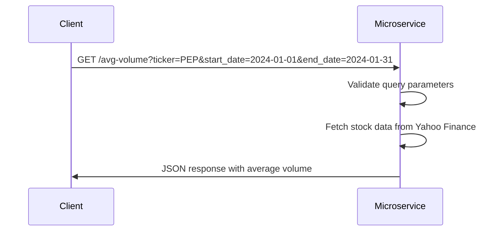

# Average Trading Volume Microservice

This microservice provides an endpoint to calculate the average trading volume of a stock using the Yahoo Finance API.

---

## Communication Contract

### How to Programmatically Request Data
To request data from the microservice, make a `GET` request to the `/avg-volume` endpoint using the following parameters:

`ticker` -- String --  The stock ticker symbol (e.g., `PEP`) 
`start_date` -- String -- Start date in the format `YYYY-MM-DD`
`end_date` -- String -- End date in the format `YYYY-MM-DD`

#### Example Request

curl -X GET "http://localhost:1234/avg-volume?ticker=PEP&start_date=2024-01-01&end_date=2024-01-31"

### How to Programmatically Receive Data
The microservice responds with a JSON object containing the following:

`ticker` -- String -- The stock ticker symbol 
`average_volume` -- Float -- The average trading volume over the specified date range
`message` -- String -- Success message or error message  

#### Example Response (Success)

{
  "ticker": "PEP",
  "average_volume": 73431340.2,
  "message": "Success"
}

## UML Sequence Diagram
Below is a UML sequence diagram that describes the interaction between the client and the microservice:

